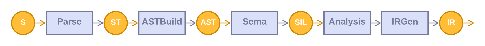
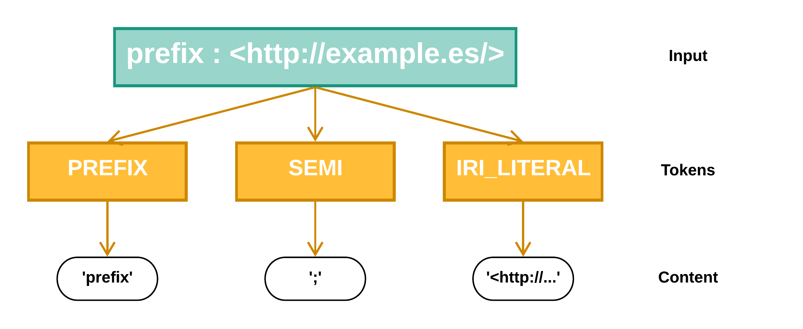
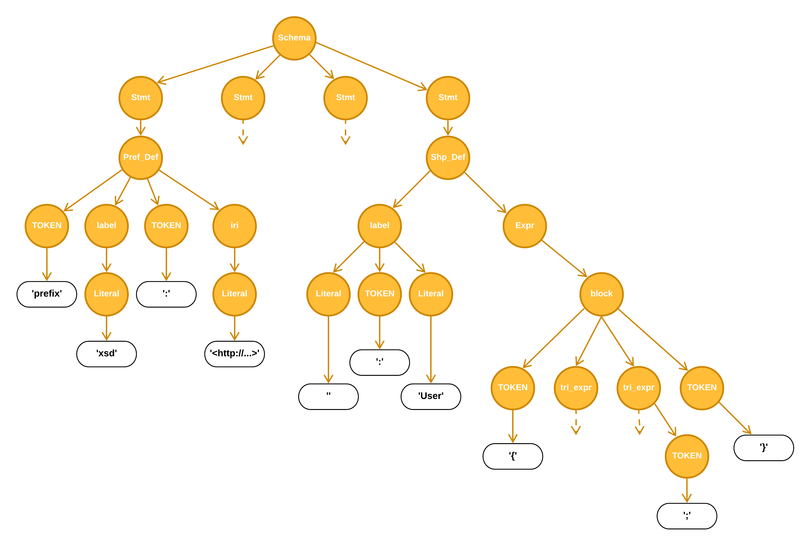
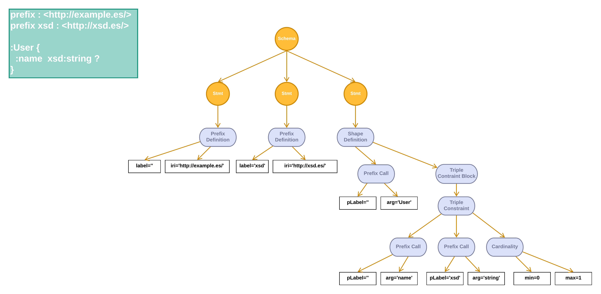

# Compiler Architecture
As a whole, the ShEx-Lite compiler is principally responsible for translating Shex-Lite source code into dofferent intermediate representations like Java, Python or HTML. However, the Shex-Lite compiler front-end is ready for integration with other tools like IDE and syntax coloring thanks to its API design inspired in modern compilers like Roslyn, SwiftC or RustC. This document gives a low-level description of the componenets of the ShEx-Lite Compiler.

The following image illustrates a high-level view of the different compiling stages.

But if we want to take a deeper look into the path that follows an input program until it becames an output the following diagram is perfect.

## Lexer
In ShEx-Lite we use Antlr to define our set of tokens and rules that form the grammar. The lexer file has one and only one propose. To define all possible tokens that the source file might contain. For example:

Here we can see that the input `prefix : <http://example.es>` is broken into three tokens. The token `prefix`, the token `semi` and the token `iri_literal`.

> It is important to remark that all blanks and new lines are sent to a hidden channel of tokens and therefore, by default, are not seen nor by the lexer nor the parser.

Again, the aim of defining operators, separators an other special characters as tokens instead of hardcoding them in the grammar, is that with this approach we can process them in the Syntax Tree that the parser will generate.

## Parsing
The parser is reponsible of emit warnings and errors for grammatical problems with the input source and generate the Syntax Tree. The syntax tree contains all the syntax information present in the input files, that is all the rules and token from the grammar and the lexer.

The grammar and the lexer both are implemented with Antlr tool. That allows to speed up the development of the parser itself.

After the parsing stage we get a syntax tree with sintactic information as the next one.

### Why not to get the AST direcly and do this intermediate step?
When we design the ShEx-Lite compiler we didn't want to be just another compiler. With this stage we can provide developers with the pure Syntax Tree with all the information from the grammar rules and tokens from the lexer. That means that developers can add syntax validators as needed. For example a developer might want to implement a validation to validate that every triple expression is followed by the semicolon token (which are optional). In this case it is as easy as exploring the syntax tree and emit the warning/error if the situation os detected.

## Syntax Tree Parsing
After we have the Syntax Tree, in order to continue working with our schema, there're lots of information that we don't need, like braces or semicolons. Therefore we transform the Syntax Tree into an Abstract Syntax Tree. This way we have a much more clean tree where each node represents information from the schema. Like statements or expressions.

The following example represents the Abstract Syntax Tree generated for the schema that is in the green box. That is a unique shape expression that represents that a node that conforms to `:User` might have or might not have a property called `:name` with type `xsd:string`.

Again as we can see this AST does not contain any semantic or type information. It is just the translation from the Syntax Tree to our Abstract Syntax.

ShEx-Lite compiler also offers access of this Abstract Syntax Tree to developers by means of an API so they can inspect, work and transform it.

## Semantic Analysis
This step is responsible for taking the parsed AST and transform it into a well-formed, fully-type-checked form of the AST (we've called this the Shex-lite Intermediate Language - SIL), emitting warnings or errors for semantic problems in the source code.
Semantic Analysis includes definition inference and, on success, indicates that is safe to generate code from the resulting, SIL graph.

The following example is exactly the same input source code as before. This time we use the semantic analysis in order to add definition information and check all types in the previous AST. The result is this SIL graph the relates invocations to its definitions.

## SIL Analysis

## IR Generation
